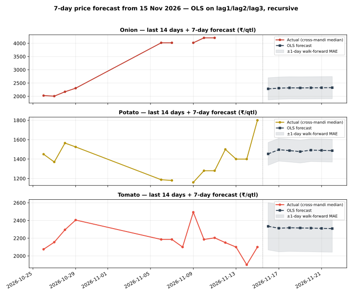

# Day 23 — 7-day price forecast table in the daily report

## Method (read this first)

The champion model from Weeks 2–3 — plain OLS on lag1/lag2/lag3
per commodity, pooled across the 8 mandis (Day 22: ridge
regularisation is a verified null, alpha=0; Day 18/19: OLS
beats MA3 and the random forest out-of-sample) — is refitted
on **all history known as of today** and run recursively:
day h=1 uses real lags from the latest prices, days h=2..7
feed the previous forecasts back in as lags. No future
information enters at any step. The portal's National rows
are an all-India aggregate with a 3-day series, so they never
clear the 3-lag requirement and are excluded — the forecasts
run on the 8 mandi series (latest actual date
15 Nov 2026), exactly like the earlier scoring days.

## Empirical error scale

Walk-forward: refit on history up to 7 days ago, then
one-step-ahead on the last 7 days, per commodity:

| Commodity | Walk-forward 1-day MAE (₹/qtl) | n |
|---|---|---|
| Onion | 419.12 | 21 |
| Potato | 117.49 | 9 |
| Tomato | 266.66 | 16 |

The table below shows **point forecasts**. A fair mental
band is ±(1-day MAE × horizon): error compounds because each
forecast day reuses the previous day's forecast as a lag.
The forecast also inherits whatever drift the last 3 days
carried — a 7-day OLS forecast cannot predict a shock.

## 7-day forecast table

### Onion — latest actual 15 Nov 2026

| Market | 16 Nov | 17 Nov | 18 Nov | 19 Nov | 20 Nov | 21 Nov | 22 Nov |
|---|---|---|---|---|---|---|---|
| Azadpur | 3,976 | 3,867 | 3,765 | 3,655 | 3,559 | 3,470 | 3,387 |
| Bowenpally | 2,267 | 2,282 | 2,314 | 2,307 | 2,310 | 2,315 | 2,318 |
| Koyambedu | 2,401 | 2,396 | 2,415 | 2,404 | 2,399 | 2,398 | 2,394 |
| Muhana | 2,119 | 2,132 | 2,156 | 2,169 | 2,183 | 2,196 | 2,208 |
| Naroda | 2,502 | 2,460 | 2,490 | 2,472 | 2,461 | 2,455 | 2,448 |
| Sealdah Koley Market | 2,294 | 2,330 | 2,323 | 2,324 | 2,329 | 2,330 | 2,332 |
| Vashi | 2,142 | 2,154 | 2,163 | 2,180 | 2,194 | 2,205 | 2,217 |
| Yeshwanthpur | 2,107 | 2,140 | 2,149 | 2,165 | 2,180 | 2,193 | 2,205 |

### Potato — latest actual 15 Nov 2026

| Market | 16 Nov | 17 Nov | 18 Nov | 19 Nov | 20 Nov | 21 Nov | 22 Nov |
|---|---|---|---|---|---|---|---|
| Azadpur | 1,268 | 1,308 | 1,328 | 1,365 | 1,390 | 1,405 | 1,422 |
| Bowenpally | 1,578 | 1,513 | 1,582 | 1,548 | 1,521 | 1,528 | 1,520 |
| Koyambedu | 1,598 | 1,564 | 1,615 | 1,567 | 1,543 | 1,545 | 1,533 |
| Muhana | 1,431 | 1,417 | 1,432 | 1,450 | 1,454 | 1,460 | 1,467 |
| Naroda | 1,553 | 1,502 | 1,536 | 1,524 | 1,508 | 1,510 | 1,507 |
| Sealdah Koley Market | 1,445 | 1,548 | 1,507 | 1,487 | 1,505 | 1,500 | 1,493 |
| Vashi | 1,462 | 1,491 | 1,435 | 1,463 | 1,478 | 1,470 | 1,475 |
| Yeshwanthpur | 1,434 | 1,487 | 1,468 | 1,467 | 1,480 | 1,480 | 1,480 |

### Tomato — latest actual 15 Nov 2026

| Market | 16 Nov | 17 Nov | 18 Nov | 19 Nov | 20 Nov | 21 Nov | 22 Nov |
|---|---|---|---|---|---|---|---|
| Azadpur | 2,232 | 2,244 | 2,255 | 2,266 | 2,273 | 2,279 | 2,284 |
| Bowenpally | 1,655 | 1,729 | 1,857 | 1,956 | 2,021 | 2,080 | 2,126 |
| Koyambedu | 2,460 | 2,368 | 2,434 | 2,386 | 2,360 | 2,357 | 2,344 |
| Muhana | 2,131 | 2,181 | 2,160 | 2,206 | 2,228 | 2,239 | 2,253 |
| Naroda | 2,638 | 2,515 | 2,529 | 2,469 | 2,428 | 2,408 | 2,385 |
| Sealdah Koley Market | 2,632 | 2,570 | 2,527 | 2,474 | 2,439 | 2,412 | 2,389 |
| Vashi | 2,437 | 2,410 | 2,375 | 2,365 | 2,353 | 2,341 | 2,334 |
| Yeshwanthpur | 2,200 | 2,257 | 2,261 | 2,264 | 2,275 | 2,280 | 2,284 |

## Verification

Hand-check on Azadpur Onion: recomputing h=1 and h=2 from the
coefficients by hand gives Rs 3975.61 and Rs 3867.08/qtl —
both **match** the module output exactly, so the recursion is
verified. Re-running the script produces a byte-identical CSV
(deterministic), and the chart parses as valid SVG.

## Reading the result

Prices are strongly autocorrelated day to day, so h=1
forecasts mostly say 'tomorrow looks like yesterday, pulled
slightly toward the last few days'. By h=7 the forecast has
converged toward the series' recent drift — treat day 5–7
values as directional, not precise. This table now ships in
every daily report via run_daily.py (forecast_table.py runs
right after analyze.py), so tomorrow's report will carry a
fresh 7-day table automatically. Day 24's rolling-MAE
dashboard will start tracking these forecasts against
realised prices as they arrive.

