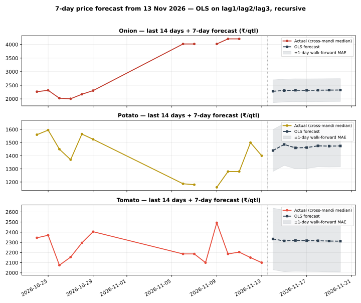

# Day 23 — 7-day price forecast table in the daily report

## Method (read this first)

The champion model from Weeks 2–3 — plain OLS on lag1/lag2/lag3
per commodity, pooled across the 8 mandis (Day 22: ridge
regularisation is a verified null, alpha=0; Day 18/19: OLS
beats MA3 and the random forest out-of-sample) — is refitted
on **all history known as of today** and run recursively:
day h=1 uses real lags from the latest prices, days h=2..7
feed the previous forecasts back in as lags. No future
information enters at any step. The portal's National rows
are an all-India aggregate with a 3-day series, so they never
clear the 3-lag requirement and are excluded — the forecasts
run on the 8 mandi series (latest actual date
13 Nov 2026), exactly like the earlier scoring days.

## Empirical error scale

Walk-forward: refit on history up to 7 days ago, then
one-step-ahead on the last 7 days, per commodity:

| Commodity | Walk-forward 1-day MAE (₹/qtl) | n |
|---|---|---|
| Onion | 419.12 | 21 |
| Potato | 159.16 | 11 |
| Tomato | 303.08 | 17 |

The table below shows **point forecasts**. A fair mental
band is ±(1-day MAE × horizon): error compounds because each
forecast day reuses the previous day's forecast as a lag.
The forecast also inherits whatever drift the last 3 days
carried — a 7-day OLS forecast cannot predict a shock.

## 7-day forecast table

### Onion — latest actual 13 Nov 2026

| Market | 14 Nov | 15 Nov | 16 Nov | 17 Nov | 18 Nov | 19 Nov | 20 Nov |
|---|---|---|---|---|---|---|---|
| Azadpur | 3,976 | 3,867 | 3,765 | 3,655 | 3,559 | 3,470 | 3,387 |
| Bowenpally | 2,267 | 2,282 | 2,314 | 2,307 | 2,310 | 2,315 | 2,318 |
| Koyambedu | 2,401 | 2,396 | 2,415 | 2,404 | 2,399 | 2,398 | 2,394 |
| Muhana | 2,119 | 2,132 | 2,156 | 2,169 | 2,183 | 2,196 | 2,208 |
| Naroda | 2,502 | 2,460 | 2,490 | 2,472 | 2,461 | 2,455 | 2,448 |
| Sealdah Koley Market | 2,294 | 2,330 | 2,323 | 2,324 | 2,329 | 2,330 | 2,332 |
| Vashi | 2,142 | 2,154 | 2,163 | 2,180 | 2,194 | 2,205 | 2,217 |
| Yeshwanthpur | 2,107 | 2,140 | 2,149 | 2,165 | 2,180 | 2,193 | 2,205 |

### Potato — latest actual 13 Nov 2026

| Market | 14 Nov | 15 Nov | 16 Nov | 17 Nov | 18 Nov | 19 Nov | 20 Nov |
|---|---|---|---|---|---|---|---|
| Azadpur | 1,266 | 1,305 | 1,325 | 1,361 | 1,385 | 1,401 | 1,418 |
| Bowenpally | 1,433 | 1,465 | 1,454 | 1,459 | 1,469 | 1,470 | 1,472 |
| Koyambedu | 1,599 | 1,565 | 1,613 | 1,566 | 1,542 | 1,543 | 1,530 |
| Muhana | 1,429 | 1,415 | 1,430 | 1,447 | 1,450 | 1,456 | 1,463 |
| Naroda | 1,551 | 1,501 | 1,534 | 1,521 | 1,505 | 1,507 | 1,504 |
| Sealdah Koley Market | 1,446 | 1,545 | 1,505 | 1,486 | 1,502 | 1,496 | 1,491 |
| Vashi | 1,460 | 1,487 | 1,433 | 1,460 | 1,474 | 1,467 | 1,471 |
| Yeshwanthpur | 1,433 | 1,484 | 1,466 | 1,465 | 1,477 | 1,476 | 1,477 |

### Tomato — latest actual 13 Nov 2026

| Market | 14 Nov | 15 Nov | 16 Nov | 17 Nov | 18 Nov | 19 Nov | 20 Nov |
|---|---|---|---|---|---|---|---|
| Azadpur | 2,239 | 2,253 | 2,265 | 2,276 | 2,283 | 2,289 | 2,293 |
| Bowenpally | 1,794 | 1,901 | 1,966 | 2,063 | 2,121 | 2,162 | 2,198 |
| Koyambedu | 2,453 | 2,362 | 2,423 | 2,376 | 2,353 | 2,349 | 2,338 |
| Muhana | 2,144 | 2,197 | 2,180 | 2,225 | 2,247 | 2,257 | 2,270 |
| Naroda | 2,618 | 2,493 | 2,504 | 2,445 | 2,406 | 2,388 | 2,368 |
| Sealdah Koley Market | 2,609 | 2,545 | 2,501 | 2,448 | 2,415 | 2,391 | 2,371 |
| Vashi | 2,428 | 2,401 | 2,368 | 2,358 | 2,346 | 2,336 | 2,330 |
| Yeshwanthpur | 2,210 | 2,266 | 2,270 | 2,274 | 2,285 | 2,290 | 2,294 |

## Verification

Hand-check on Azadpur Onion: recomputing h=1 and h=2 from the
coefficients by hand gives Rs 3975.61 and Rs 3867.08/qtl —
both **match** the module output exactly, so the recursion is
verified. Re-running the script produces a byte-identical CSV
(deterministic), and the chart parses as valid SVG.

## Reading the result

Prices are strongly autocorrelated day to day, so h=1
forecasts mostly say 'tomorrow looks like yesterday, pulled
slightly toward the last few days'. By h=7 the forecast has
converged toward the series' recent drift — treat day 5–7
values as directional, not precise. This table now ships in
every daily report via run_daily.py (forecast_table.py runs
right after analyze.py), so tomorrow's report will carry a
fresh 7-day table automatically. Day 24's rolling-MAE
dashboard will start tracking these forecasts against
realised prices as they arrive.

